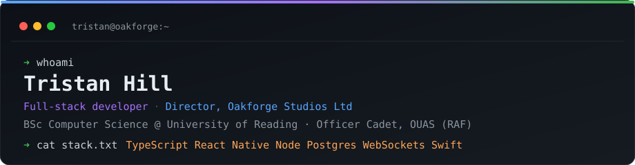
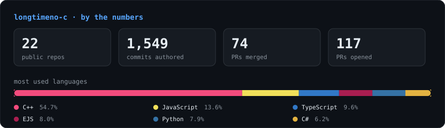

  <picture>
    <source media="(prefers-color-scheme: dark)" srcset="banner-dark.svg">
    <source media="(prefers-color-scheme: light)" srcset="banner-light.svg">
    
  </picture>

  
  
  
  

---

## About

Full-stack developer and founder based in Reading, UK. I run **[Oakforge Studios Ltd](https://oakforgestudios.co.uk)**, a UK software company through which I publish and maintain App Store applications — including their backends, authentication, and billing.

Currently reading for a **BSc in Computer Science (with Year in Industry)** at the University of Reading, where I finished my first year on track for a **first**, and serving as an **Officer Cadet with the Oxford University Air Squadron (RAF)**, where I have been appointed **Officer in Charge of Motor Transport** for the 2026/27 training year.

Most of my work sits at the intersection of real-time systems, mobile apps, and the networking infrastructure underneath them. If it involves WebSockets, a rack of servers, or shipping something end to end on my own — that is usually where you will find me.

---

## Currently building

| Project | What it is | Stack |
| :--- | :--- | :--- |
| **[Pintless](https://pintless.oakforgestudios.co.uk)** | Social drink-tracking app on the App Store — achievements, location, pub-crawl events, home-screen widget, subscription paywall. | React Native · Expo · TypeScript |
| **[Advanced Tutoring](https://advancedtutoring.uk)** | Full-stack tutoring platform: role-specific dashboards, scheduling, Stripe payments, video calling, collaborative whiteboard, mobile app. | Next.js · Prisma · PostgreSQL · Stripe |
| **[Missile Wars Revival](https://github.com/Missile-Wars-Revival)** | Real-time geolocation strategy game with live multiplayer state and 300+ followers at launch. | React Native · WebSockets · Prisma |

---

## Open source

I spend a lot of time in the Expo / React Native ecosystem, upstreaming fixes where I hit them rather than patching around them.

- **[EvanBacon/serve-sim](https://github.com/EvanBacon/serve-sim)**  — hosts an Apple Simulator over HTTP so agent tooling (Codex, Cursor, Claude) can drive it. My [PR #80](https://github.com/EvanBacon/serve-sim/pull/80) `merged` shipped a universal `arm64` + `x86_64` binary so the tool runs on Intel Macs, with a test suite asserting the built binary's architecture and executability. Currently working on [real-device support (#83)](https://github.com/EvanBacon/serve-sim/pull/83).
- **[expo](https://github.com/longtimeno-c/expo/pull/1)** `in progress` — one-command macOS and tvOS support for Expo: config plugins, prebuild, and `run:macos`.

## Other work

- **[Stream150](https://watch.stream150.com)** — custom streaming platform I built and operated. Multi-camera and multi-desktop capture, custom HLS player, live polls, moderated chat, resilient WebSocket reconnection.
- **[OUAS Flypro automation](https://github.com/longtimeno-c/flypro-booking)** — Google Apps Script that runs the squadron's weekly flying programme end to end: validates the week's flying, MT, duty-student and accommodation entries, generates the Flypro PDF and MT document, sends the notification emails, then locks and rolls the week over on a schedule.
- **[TristanBio](https://github.com/longtimeno-c/TristanBio)** — my portfolio site. Next.js 15, TailwindCSS, Sanity CMS, Framer Motion, with project content pulled live from the CMS and GitHub.
- **WebRTC calling system** — video calls with screen sharing, built on Daily.co.
- **OBS tooling** — scene-specific replay cache plugin (C++), advanced scene switcher (Python), a Discord bot that auto-adds links as OBS scenes, and an NDI live indicator for multi-PC setups.
- **Progress for Britain** — substantial contributions across the web platform: policy management system, onboarding flows, UI revamp, captcha, Cloudflare setup.

---

## Experience

**Oakforge Studios Ltd** — *Founder & Director* · 2025 – present  
Sole director of a UK limited company shipping mobile applications, responsible for all technical and commercial operations — including Corporation Tax, Companies House filings, and the Apple Developer organisation account.

**Oxford University Air Squadron (RAF)** — *Officer Cadet, OIC Motor Transport (2026/27)* · 2025 – present  
Manage the squadron's vehicle fleet: tasking, bookings, serviceability, and documentation. Flying, leadership, and force-development training alongside full-time study.

**One Studio One Game, LLC** — *CEO & Lead Developer* · 2024 – 2025  
Built and shipped *Missile Wars* front to back — React Native client, WebSocket backend, Prisma data layer. Incorporated the project as a Delaware LLC for distribution and wound it down on completion.

**University of Southampton** — *IT Technician Intern* · 2023  
Built Icinga2 and Cacti monitoring for university servers and networks, plus MySQL-backed server status systems, working with Prof. Richard Boardman.

**Taunton Deane Swimming Club** — *Coach & Web Developer* · 2021 – present  
Level 2 swim teacher coaching competitive squads. Designed and maintain the club website, automating member management with custom scripts.

---

## Toolbox

**Languages**  

  
  
  
  
  

**Frameworks & platforms**  

  
  
  
  
  
  

**Data & infrastructure**  

  
  
  
  
  
  
  
  
  

Away from the keyboard I build PCs and home servers, design segmented 10Gb networks, and have wired a house for CCTV end to end.

---

## Stats

  <picture>
    <source media="(prefers-color-scheme: dark)" srcset="stats-dark.svg">
    <source media="(prefers-color-scheme: light)" srcset="stats-light.svg">
    
  </picture>

Generated from the GitHub API by <a href="scripts/build_stats.py"><code>scripts/build_stats.py</code></a> and refreshed weekly — no third-party stats service.

---

## Education & awards

**University of Reading** — BSc Computer Science with Year in Industry, 2025 – 2030  
Currently on a first after completing year one.  
A-Levels in Computer Science, Mathematics and Geography. EPQ on AI in weather prediction, focused on Graph Neural Networks and NVIDIA's Earth-2 project.

🏆 Outstanding Computer Science Student Award — for a Swift messaging app  
🏆 Alan Turing Prize for Computer Science  
🏆 Gold Duke of Edinburgh Award

---

## Elsewhere

  
  
  

Open to Year in Industry placements and interesting problems. References available on request.
